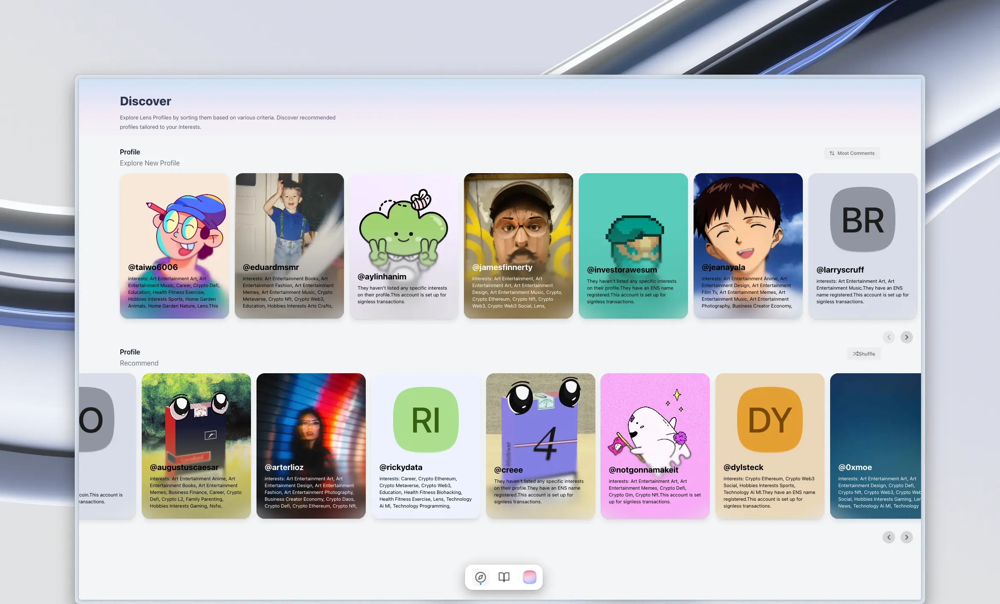
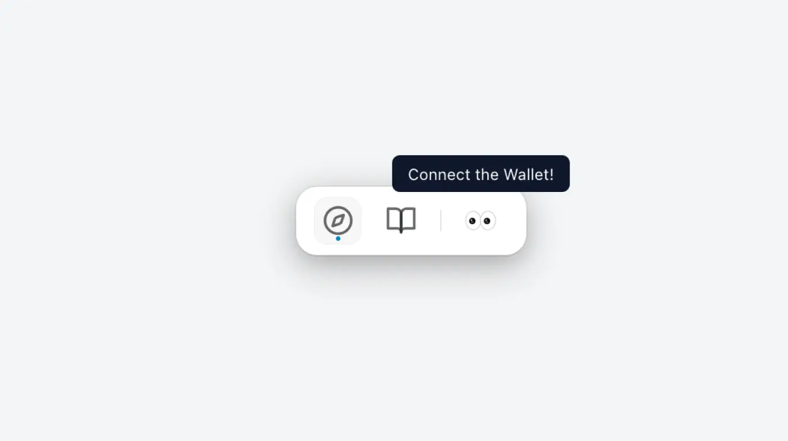
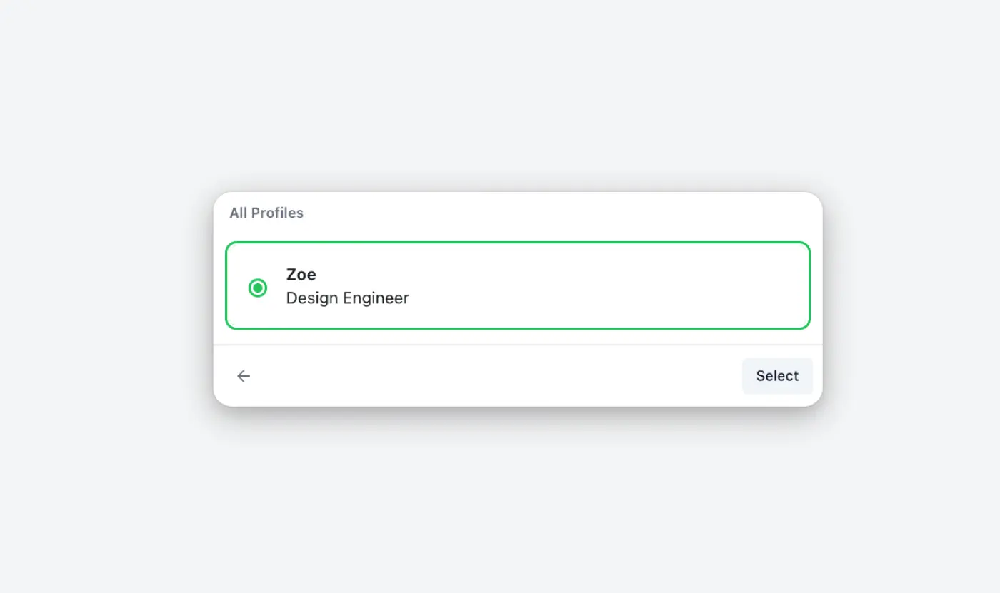

# lens-sdk-example

This repository provides an example application using the [Lens Protocol SDK]((https://docs.lens.xyz/docs)) with [Next.js](https://nextjs.org/). The application is bootstrapped using [create-next-app](https://github.com/vercel/next.js/tree/canary/packages/create-next-app).

## Getting Started

Start by renaming the `.env.example` file to `.env` and then populate it with the necessary values:

- `NEXT_PUBLIC_WALLETCONNECT_PROJECT_ID`
  - This is the Project ID for WalletConnect. You can create a free Project ID at [WalletConnect Cloud](https://cloud.walletconnect.com/sign-in).

After setting up the environment variables, launch the development server:

```bash
# if you use nvm
nvm use
# install dependencies
npm install
# run development server
npm run dev
```

Open [http://localhost:3000](http://localhost:3000) to view the app in your browser.

## How to use?



### 1. Connect the wallet



Click the 👀 button in the bottom floating action bar.

### 2. Select Profile



After connecting your wallet, select a profile from the list. If you don't have a Lens profile, you can create one [here](https://www.lens.xyz/).

### 3. Explore Profiles

Discover other profiles through two main sections:

- Explore Section: Browse profiles sorted by various criteria.
- Recommend Section: View personalized recommendations based on your social graph and engagement data.

## Technologies Used

- [Next.js](https://nextjs.org)
- [Lens Protocol SDK](https://docs.lens.xyz/docs)
- [Wagmi](https://wagmi.sh/)

### For Styling

- [tailwindcss](https://tailwindcss.com)
- [framer-motion](https://www.framer.com/motion/)
- [daisy-ui](https://daisyui.com)
- [radix-ui](https://www.radix-ui.com)

## Development Decisions

### Folder Structure

```
src/
├── app/
├── components/
│   ├── Reusable UI components such as buttons, forms, and layout elements.
├── domains/
│   ├── [domain]/
│   │   ├── Domain-specific logic, components, and services (e.g., auth, user).
├── hooks/
│   ├── [utility hook].ts
│   ├── Custom React hooks for managing state and side effects.
├── pages/
│   ├── [page]/
│   ├── Components specific to a particular page, not intended for use on other pages.
├── utils/
│   ├── Utility functions and helpers used throughout the application.
```

### Functional Components

There are many headless components which have only 'logic'.

If 'logic' is tightly coupled with specific view, it becomes difficult to accommodate various product requirements. The design incorporates components that provide only logic, allowing for flexible responses to changes.

In this project, ConnectWallet and WhenLoggedIn are representative examples of this approach.

### Compound Component

The Compound Component Pattern involves two or more components working together to fulfill a required function.

```tsx
// src/components/ui/ActionBar
<ActionBar>
  <ActionBar.List>
    <ActionBar.Item value="a" />
    <ActionBar.Item value="b" />
  </ActionBar.List>
  <ActionBar.Content value="a">A</ActionBar.Content>
  <ActionBar.Content value="b">B</ActionBar.Content>
</ActionBar>

// and `ui/VerticalImageCard`, `Dropdown` etc...
```

It is organized into parent-child components, with implicit state sharing between them.
This pattern facilitates encapsulation, semantic structure, and flexibility in component design."
